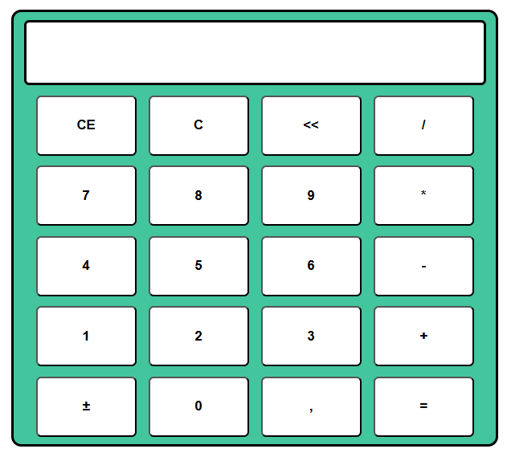

# 🧮 Calculadora Web Interativa

Este é um projeto de **calculadora aritmética** desenvolvido com **JavaScript**, **HTML** e **CSS**, que simula o funcionamento de uma calculadora física básica com suporte a operações matemáticas simples e funcionalidades adicionais, como CE, C, apagar dígito, inversão de sinal e suporte a números decimais.

**Créditos**: Fiz este projeto de acordo com o enunciado proposto pelo professor [Fernando Leonid](https://youtu.be/oRZQ5EZOrQk?si=ya4FT2Hkrosyt8l8).

## 🔧 Funcionalidades

- Operações básicas: adição (`+`), subtração (`-`), multiplicação (`*`) e divisão (`/`)
- CE e &lt;&lt;: limpam o último dígito digitado
- C: limpa toda a operação
- ±: inverte o sinal do número
- Vírgula (`,`): adiciona separador decimal (suporte à notação brasileira)
- Tratamento de resultados inválidos (ex: divisão por zero)
- Formatação de números decimais com `,` para melhor visualização

## 📦 Tecnologias utilizadas

- HTML
- CSS
- JavaScript Puro (Vanilla JS)

## ▶️ Demonstração

https://github.com/user-attachments/assets/83bfa411-5a2f-4ce7-8906-c831b21430c9

## 🧠 Estrutura do Código

- `clicou_botao()`: função principal de controle dos botões
- `faz_operacao_aritmetica()`: executa as operações matemáticas
- `trata_resultado()`: formata e exibe o resultado na tela
- `trata_decimal()`: converte entre `,` e `.`
- Funções auxiliares:
  - `faz_operacao_ce()`, `faz_operacao_c()`, `faz_operacao_a()`
  - `faz_operacao_inverter_sinal()`
  - `faz_operacao_adicionar_virgula()`
  - `obtem_operador()`

## 💡 Observações

- A calculadora suporta operações encadeadas de dois em dois operandos.

## 🖼️ Interface

- A interface simula uma calculadora comum com visor e botões numéricos funcionais.  
- O visor é atualizado conforme as interações com os botões.
